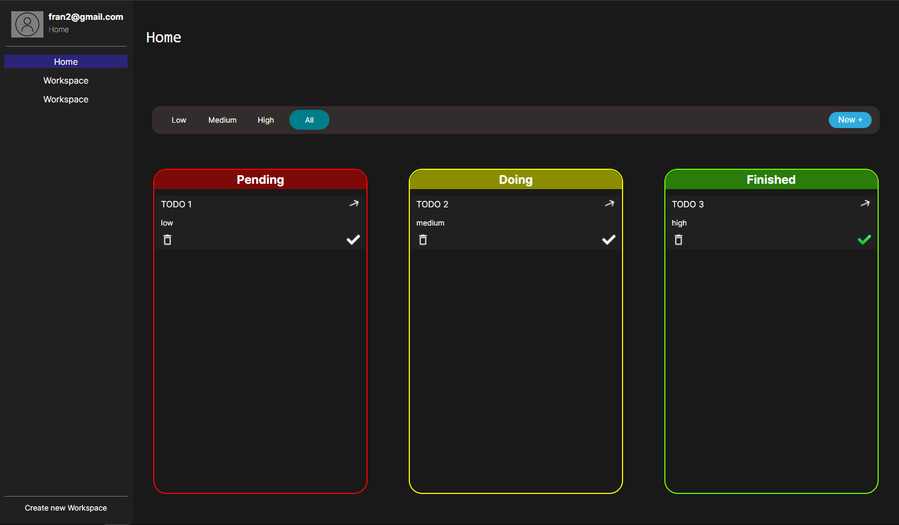

# TODO_machine_frontend
## Resume
This is the code for Frontend/UI of the TODO_machine app. Its build using React, React Router, formik, React dnd, Yup, styled components, Axios and Vite. 
Link: https://todo-machine-frontend.netlify.app
Backend repo: https://github.com/patxxi/TODO-machine-backend
Backend deployment: https://todo-machine.onrender.com/api/
### Important note
Render free tier for web services put in rest the app if in the last 15 minutes theres no any request. So may the first request to the api could take some time.
Also, for development you may wanna change DATABASE variable in settings. It is development using Postgress db as well as in the deployment server

## Main page

## Detail

## Create new TODO

## Commands
 - npm install --> Install all dependencies
 - npm run dev --> Dev bundler and start dev server
 - npm run build --> Production bundler